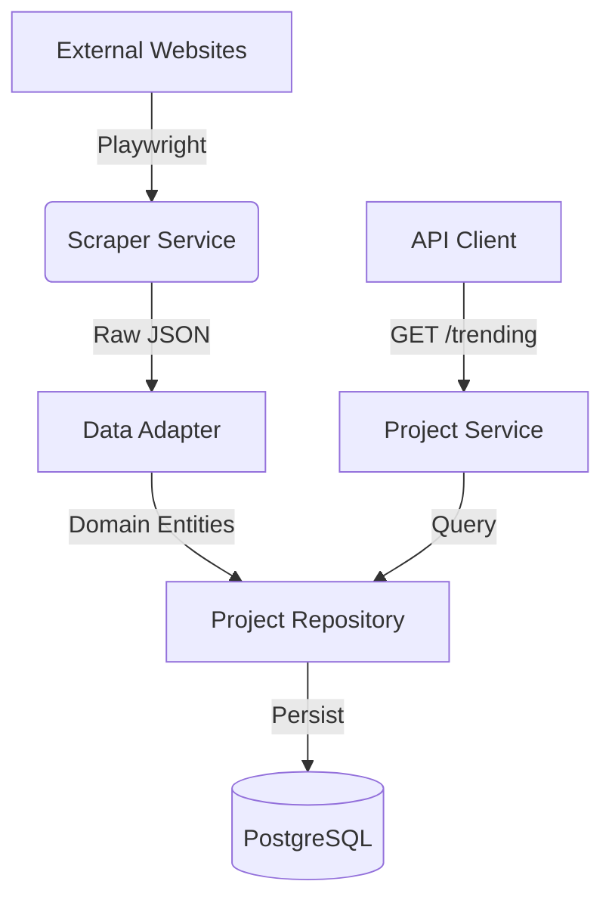

# 🏗️ DATA INGESTION ARCHITECTURE (CLEAN ARCHITECTURE)

**Pattern**: Adapter Pattern + Repository Pattern  
**Goal**: Decouple "Scraping Logic" from "Core Domain".

---

## 1. High-Level Operations

---

## 2. Component Design (Modular)

### A. Scraper Layer (`apps/api/scrapers/`)
**Responsibility**: Fetch raw HTML/content, resilient to DOM changes.
- `trending.py`: Targets specific high-value domains.
- `Output`: `trending_data.json` (Interchange format).

### B. Ingestion Service (`apps/api/routers/ingest.py`)
**Responsibility**: Transformation & Validation (Anti-Corruption Layer).
- Validates price formats (`1.2 Cr` -> `12000000`).
- Validates coordinates within Hyderabad bounds.
- Maps `img_url` to secure CDN paths (or seeded fallbacks).

### C. Domain Layer (`apps/api/domain/models.py`)
**Responsibility**: Pure business logic.
- `Project`: Core entity with `id`, `name`, `trust_score`.
- `Listing`: Linked entity.

---

## 3. Real-World Data Strategy (Demo Day)

To ensure **Optimal UX** without fragility:
1.  **Seed Mode**: API starts with pre-loaded `trending_data.json` (Curated High-Res).
2.  **Live Mode**: Background worker runs `trending.py` update every 6 hours.
3.  **Fallback**: If scraper fails (bot check), serve Seed Data.

---

**Standards Compliance**:
- **SOLID**: Single Responsibility Principles applied to Scrapers vs Writers.
- **LLM-Friendly**: Code is modular, typed, and documented for future AI refactoring.
