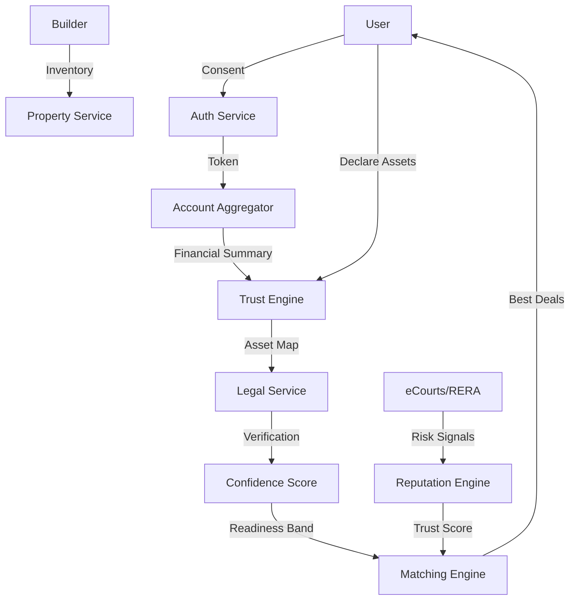

# SYSTEM ARCHITECTURE - PropMubi Trust OS

## High-Level: Hybrid Monorepo

```
propmubi/
├── apps/
│   ├── mobile/         # React Native (Expo) - Consumer App (Feed, Maps)
│   ├── web/            # Next.js - Admin, Builder Portal, Legal Dashboard
│   └── api/            # FastAPI (Python) - Core Logic Mesh
├── packages/
│   ├── ui/             # Tamagui/NativeWind - Unified UI
│   └── risk-engine/    # Shared Python/Rust logic for Scoring
└── infrastructure/     # Terraform (AWS) + K8s
```

## Microservices Mesh

1.  **Core Services**:
    *   `auth-service`: Identity & Consent Management.
    *   `property-service`: Geo-spatial Inventory (PostGIS).
    *   `media-service`: Video transcoding & Twin rendering.

2.  **Trust OS Services** (The Differentiators):
    *   `trust-service`: User Financial Confidence (Account Aggregator Listener).
    *   `reputation-service`: Builder scoring (Data ingest from RERA/Courts).
    *   `legal-service`: Document verification workflows.
    *   `inspection-service`: Quality snagging & reporting.

## Data Architecture (PostgreSQL + PostGIS)

### "Trust Layer" Data Flow
**Principle**: We aggregate flows, we don't store raw sensitive data.



## Key Engines

### 1. The Geo-Spatial Engine (`property-service`)
- **Input**: User Viewport (Lat/Long Box).
- **Processing**: PostGIS `ST_Intersects` + `ST_DWithin`.
- **Output**: GeoJSON with "Lite" metadata for high-FPS map rendering.

### 2. The Financial Confidence Engine (`trust-service`)
- **Inputs**: Net Income Band (AA), Credit Score Band, Asset Value (Verified).
- **Logic**: `Score = (IncomeStability * 0.5) + (AssetBacking * 0.3) + (CreditHistory * 0.2)`.
- **Output**: "Platinum/Gold/Silver" Buyer Tier (Visible to Builders).

### 3. Builder Reputation Engine (`reputation-service`)
- **Inputs**: Delivery Delays (historic), Legal Case Volume, User Reviews.
- **Logic**: Decay function where recent delays hurt score more than old ones.

### 4. Marketing & Content Engine (`marketing-service`)
- **Inputs**: Canonical Property Data, Legal Status, Construction Updates.
- **Logic**: Template-based content generation (Reels, Posts) governed by "Truth" data.
- **Outputs**: WhatsApp Cards, Social Posts, Email Newsletters.

### 5. Agent Supply Sensor Network
- **Components**: WhatsApp Bot (Ingestion), Verification Queue.
- **Logic**: "Soft Supply" ingestion -> Verification -> Trusted Listing.


## Infrastructure

- **Database**: PostgreSQL 15 (Main) + PostGIS extension.
- **Cache**: Redis Cluster (Geo-hashing for Feed).
- **Storage**: S3 (Videos, Documents, GLTF Models).
- **Queues**: RabbitMQ/Kafka (for Async Risk Processing).
