# PropMubi Trust OS - Ecosystem Integration Map

This document outlines the comprehensive integration architecture of the PropMubi Trust OS, connecting all stakeholders and digital services across the real estate lifecycle.

```mermaid
graph TD
    %% Cental Node
    TrustOS(PropMubi Trust OS Core)

    %% Stakeholders
    subgraph Stakeholders
        Admin(PropMubi Admin)
        Builder(Builder / Developer)
        Agent(Real Estate Agent)
        Consumer(Consumer / Buyer)
        Freelancer(Freelancer / Service Provider)
    end

    %% Core Connects
    Admin -->|Governs| TrustOS
    Builder -->|Onboards Projects| TrustOS
    Agent -->|Manages Leads| TrustOS
    Consumer -->|Discovers & Buys| TrustOS
    Freelancer -->|Provides Services| TrustOS

    %% Integration Layers
    subgraph Digital_Integrations [Digital Service Integrations]
        direction TB
        
        %% Government & Legal
        subgraph Govt_Legal ["🏛️ Govt, Legal & Compliance"]
            DocuSign(DocuSign / E-Signatures)
            RegExecution(Registration Execution / Land Records)
            LandDeed(Land Deed & Property Docs)
            Survey(Survey & Geo-Mapping)
            RERA(RERA / Regulatory)
            Courts(Court & Legal Integrators)
            LawyerPlatform(Lawyer Platforms)
        end

        %% Finance & Identity
        subgraph Finance_Identity ["💰 Finance, Identity & Assets"]
            LoanAggregator(Bank Loan Aggregator)
            NetWorth(Net Worth & Financial Health)
            AssetWorth(Asset Worth / Valuation)
            KYC(Identity & KYC / CKYC)
            Tax(Financial & Tax Platforms)
            Vault(Vault Check / Asset Lifecycle)
        end

        %% Growth & Marketing
        subgraph Growth ["🚀 Growth & Community"]
            SocialMedia(Social Media Integration)
            Community(Community Connections)
            LeadFunnel(Lead Funnel Optimization)
        end

        %% PropTech Services
        subgraph PropTech ["🏗️ PropTech Services"]
            PropMgmt(Property Management)
            Inspection(Property Inspection / PropTek)
            DigitalTwin(Digital Twin Providers)
        end
    end

    %% Connections to Services
    TrustOS <-->|Digitize Agreements| DocuSign
    TrustOS <-->|Execute Registration| RegExecution
    TrustOS <-->|Verifies Docs| LandDeed
    TrustOS <-->|Validates Boundaries| Survey
    TrustOS <-->|Compliance Check| RERA
    TrustOS <-->|Legal Vetting| Courts

    TrustOS <-->|Loan Offers| LoanAggregator
    TrustOS <-->|Financial Profile| NetWorth
    TrustOS <-->|User Verification| KYC
    TrustOS <-->|Secure Storage| Vault

    TrustOS <-->|Viral Distribution| SocialMedia
    TrustOS <-->|Network Effects| Community
    TrustOS <-->|Conversion| LeadFunnel
    
    %% Styling
    style TrustOS fill:#2c3e50,stroke:#fff,stroke-width:4px,color:#fff
    style Govt_Legal fill:#e1f5fe,stroke:#0288d1
    style Finance_Identity fill:#e8f5e9,stroke:#388e3c
    style Growth fill:#fce4ec,stroke:#d81b60
    style PropTech fill:#fff3e0,stroke:#f57c00
```

## Integration Descriptions

### 1. Government & Legal
*   **DocuSign / E-Signatures**: Fully digital execution of Sale Agreements and MoUs.
*   **Registration Execution**: Integration with IGRS for executing registrations.
*   **Land Deed**: Fetching digital copies of deeds.
*   **Courts**: Automated litigation checks.

### 2. Finance & Identity
*   **Bank Loan Aggregator**: Real-time integration with multiple banks for "Best Loan Offer" based on profile.
*   **Net Worth & Lead Funnel**: Analyzing buyer financial power to optimize the lead funnel.
*   **Asset Worth**: Real-time valuation tracking for users' portfolios.
*   **Vault Check**: Permanent secure storage for property lifecycle.

### 3. Growth & Community
*   **Social**: Auto-posting listings and wins to Instagram/LinkedIn/FB.
*   **Community**: Connecting buyers with neighborhood groups post-purchase.

### 4. PropTech
*   **Inspection**: "PropTek" partners for quality assurance.
*   **Digital Twin**: 3D Visualization partners.
